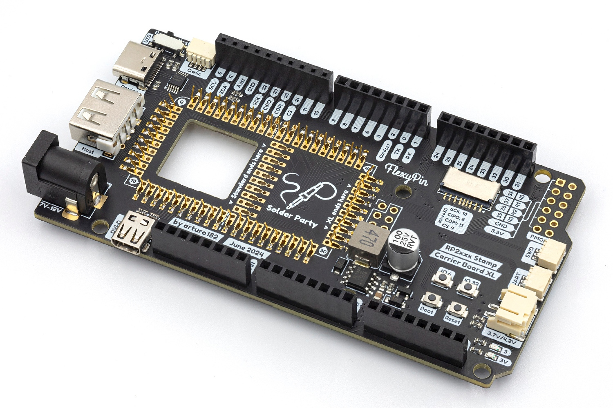

# The RP2xxx Stamp Carrier Board XL

The RP2xxx Stamp Carrier XL, as the (somewhat long) name suggests, supports all the RP2-based Stamp boards. The Mega/Due form-factor ensures compatbility with many shields, including Uno ones. The wide range of connectors on the Carrier makes it a fully-fledged RP2xxx dev board.

The Carrier comes with a combo 3-in-1 SMD/TH/FlexyPin Stamp footprint, you can solder the Stamp directly to the Carrier, use 2mm pin headers + sockets to be able to plug it in and out, or use [FlexyPins](https://docs.solder.party/flexypin) to pop the Stamp in and out of the Carrier would soldering the Stamp. This way the Carrier also acts as a great Stamp flashing and testing jig. Check out the [Assembly Options](https://docs.solder.party/rp2xxx-stamp-carrier-xl/assembly_options) page for more details.

The board can be powered from the LiPo, over USB, or with a DC jack.

By using the RP2040 Stamp Carrier, you get everything that comes with the Stamp plus:

- USB Host and Device connectors with a toggle switch
- microSD socket
- Micro HDMI-shaped connector, connected to the HSTX peripheral
- SWD JST connector, compatible with the Raspberry Pi Pico Probe
- UART JST connector, compatible with the Raspberry Pi Pico Probe
- Qwiic connector
- 3.7/4.2V LiPo connector
- two user buttons
- PMOD header
- USR LED
- Power (3.3V) LED
- DC Jack

The DC Jack input is center-positive and supports voltages in the range of 7-12V. If you have the LiPo and either DC or USB connected, the battery will begin charging.

As mentioned above, the Carrier follows the Mega/Due/Uno shield pinout, making it compatible with a large ecosystem of shields, as long as they work on 3.3V IOs. **The pins are not 5V-tolerant**.

The CircuitPython firmware for the Stamps comes with a built-in board file for the Carrier, you can access it using `import stamp_carrier_board_xl as board`. After that, you can access all the Carrier pins and interfaces like you would with any other CPY board.

# Links

For more information visit https://rp2xxx-stamp-carrier-xl.solder.party/

